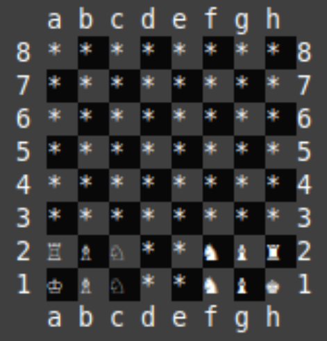

# Chess Variant

### to start
compile using the following:

    make

run using:

    ./chess

## Rules
white moves first. The first player to move their king onto row 8 is the winner, unless black finishes the next move after white does, in which case it's a tie. Pieces move the same as in normal chess, and normal chess captures are allowed. As in normal chess, a player is not allowed to expose their own king to check (including moving a piece that was blocking a check such that it no longer does). **Unlike** normal chess, a player is not allowed to put the opponent's king in check (including moving a piece that was blocking a check such that it no longer does).

Locations on the board are specified using "algebraic notation", with columns labeled a-h and rows labeled 1-8, with row 1 being the start side and row 8 the finish side.
